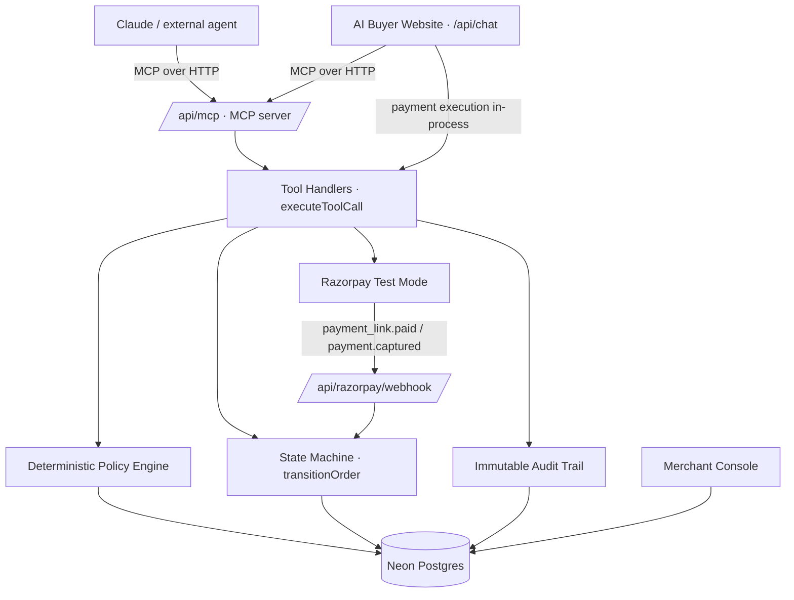

# Agentic Commerce Gateway (ACG)

**Razorpay Builderthon 2026 · Track 1 — AI Growth & Agentic Commerce**

A merchant-side control plane that lets an AI agent transact **safely** — exposed as a real **MCP server**. ACG sits between the AI agent and the merchant's money/inventory logic and enforces the guarantees a merchant actually cares about: no double-charges, no runaway spend, no purchases from restricted categories, and a full audit trail for every decision. Both a first-party website **and** an external agent like **Claude** connect to the *same* governed gateway.

## The thesis

AI agents are about to do the buying. The hard part isn't getting an LLM to call a "buy" API — it's making that safe when the model is non-deterministic, retries on timeouts, and can be talked into things. ACG's answer: **the LLM decides intent, but a deterministic gateway decides money.** Every state change goes through a single state machine, every purchase through a deterministic policy engine, Razorpay order IDs are reused rather than recreated so a confused agent can't charge twice — and the whole surface is published as an MCP server so *any* agent inherits those guarantees.

**Payment is human-authenticated by design.** An LLM cannot complete Razorpay's OTP / UPI-PIN / 3DS step, and faking a capture would be theater. So the agent's job ends at producing a **Razorpay payment link**; a human authenticates on Razorpay's hosted page, and a webhook (or polling reconciliation) confirms the order. That boundary — *the agent can create and govern an order but never autonomously move money* — is the honest, defensible core of the design.

## Architecture



Both clients call the same tool layer (`executeToolCall`), so the policy engine, state machine, and audit trail apply to every caller identically. The website additionally keeps first-party Razorpay **Checkout.js** for its in-page browser flow; external agents get a **payment link** instead (no browser to authenticate in).

**Routes:** `/` is the merchant landing + self-serve onboarding (the product), `/merchant/*` is the merchant console, `/buyer` is the reference AI buyer chat (a *client* of the gateway, not the product). `/onboard` redirects to `/` for older links.

**Design invariants**

- `transitionOrder` is the *only* thing that mutates order status. Handlers never write `status` directly. Illegal jumps (e.g. `QUOTED → CONFIRMED`) are rejected.
- Orders are keyed by a **deterministic idempotency key** (`merchantId | scope | sorted productId:qty`), not a random UUID. The same cart returns the same open order.
- **Never double-charge:** `initiate_payment` reuses an in-flight Razorpay order; `create_payment_link` reuses an open link; on a timeout the agent calls a no-charge status fetch, never re-initiates.
- Payment authorization is **human-gated** — no tool can capture a charge on the buyer's behalf.
- Every money-path step writes an immutable `AuditEvent`.

### Order state machine

```
QUOTED ─┬─→ POLICY_APPROVED ─→ PAYMENT_PENDING ─┬─→ PAYMENT_SUCCESS ─→ CONFIRMED
        │                                        ├─→ PAYMENT_FAILED ─→ (retry) PAYMENT_PENDING
        ├─→ PENDING_APPROVAL ─→ POLICY_APPROVED  └─→ PAYMENT_UNKNOWN ─→ PAYMENT_SUCCESS / FAILED
        └─→ POLICY_DENIED (terminal)
```

## The MCP server

`POST /api/mcp` is a spec-compliant **Model Context Protocol** endpoint over Streamable HTTP (JSON-RPC 2.0, stateless), built on the **official `@modelcontextprotocol/sdk`**. It exposes **8 governed commerce tools**:

`search_products` · `get_product` · `check_inventory` · `quote_order` · `check_policy` · `create_order` · `get_order_status` · `create_payment_link`

It deliberately **excludes** payment execution and mutation (`initiate_payment`, `verify_payment`, `confirm_order`, `cancel_order`, `get_payment_status`) — an external agent can discover, quote, policy-check, create an order and obtain a human-authenticated payment link, but can never autonomously charge or mutate a paid order. `merchantId` is taken from `?merchantId=` (default `merchant_sportgear`); an optional `x-trace-id` header threads a whole agent session into one console trace.

### Connect Claude (fastest path — no deploy)

Run the app locally, then bridge it into **Claude Desktop** with the `mcp-remote` stdio→HTTP shim. Add to your Claude Desktop MCP config:

```json
{
  "mcpServers": {
    "acg": { "command": "npx", "args": ["mcp-remote", "http://localhost:3000/api/mcp"] }
  }
}
```

Then ask Claude: *"Using acg, find running shoes under ₹5,000, create the order, and give me the payment link."* Claude discovers the tools, runs them through the governed gateway, and hands back a real Razorpay **test** payment link. Open it, pay with `4111 1111 1111 1111`, and the merchant console flips the order to `CONFIRMED` — with the full trace.

> Deployed path (future-ready): host on HTTPS and register a **claude.ai custom connector** (OAuth 2.1). The local endpoint is unauthenticated for the prototype; connector OAuth covers the hosted path, and per-merchant API keys are the production follow-up.

### Poke it directly

```bash
# List the governed tools
curl -s -X POST http://localhost:3000/api/mcp \
  -H 'Content-Type: application/json' \
  -d '{"jsonrpc":"2.0","id":1,"method":"tools/list"}' | jq

# Or use the official inspector
npx @modelcontextprotocol/inspector
# → transport: Streamable HTTP, URL: http://localhost:3000/api/mcp
```

### The website is an MCP client too

The website's chat backend (`/api/chat`) is a real MCP client — the SDK's `Client` over `StreamableHTTPClientTransport`, pointed at our own `/api/mcp`. It does the same `initialize` handshake Claude does and routes the same 8 governed commerce tools through it, so "the website and Claude both talk to the same MCP server" is literally true, not a diagram. One MCP session is opened per buyer conversation (keyed by `traceId`) rather than per tool call, and the conversation's trace is threaded as `x-trace-id` so agent activity lands under one trace in the console. Payment execution (Checkout.js) stays first-party in-process. If the MCP round-trip ever fails at the transport level, it falls back to the shared in-process tool layer, so the site never breaks.

### Why the SDK on both ends

Anthropic's SDK owns the protocol so we don't: version negotiation, capabilities, JSON-RPC framing and error codes, and — the part that actually matters here — **`tools/call` argument validation against the zod schemas in `src/lib/mcp/schemas.ts`, before any handler runs.** A malformed agent call gets a proper `-32602`; our policy engine and state machine only ever see well-typed input. The tool whitelist is structural rather than a list to remember: a tool exists over MCP only if it has a schema there.

The one piece we implement ourselves is the server transport (`CollectingTransport`). The SDK's `StreamableHTTPServerTransport` is written against Node's `IncomingMessage`/`ServerResponse`, while an App Router route handler receives a Web `Request` and returns a Web `Response`. Rather than fake a Node socket, we implement the SDK's own `Transport` interface — ~50 lines of HTTP framing that Next.js requires us to own anyway, with the entire protocol layer above it still the SDK's.

## Setup

```bash
npm install
cp .env.example .env    # fill in the values below
npx prisma db push      # sync schema to your Neon database
npx prisma db seed      # seed merchant, products, policy
npm run dev             # http://localhost:3000
```

### Environment

| Var | Purpose |
| --- | --- |
| `DATABASE_URL` | Neon Postgres connection string |
| `RAZORPAY_KEY_ID` / `RAZORPAY_KEY_SECRET` | Razorpay **test mode** keys (server) |
| `NEXT_PUBLIC_RAZORPAY_KEY_ID` | Same test key id, exposed to the browser for Checkout |
| `RAZORPAY_WEBHOOK_SECRET` | Optional — webhook verification skips silently if unset |
| `GROQ_API_KEY` | Groq API key for the agent LLM |
| `MCP_BASE_URL` | Optional — where the website reaches the MCP server (defaults to the request origin) |

Only `NEXT_PUBLIC_RAZORPAY_KEY_ID` is ever exposed client-side.

### Razorpay test cards

- **Success:** `4111 1111 1111 1111`, any future expiry, any CVV
- **Failure:** use any card and pick "Failure" on the mock UPI/netbanking screen

## The merchant journey (onboard → sellable to AI buyers)

The merchant is the user of this product; AI buyers are their new channel. So `/` **is** the merchant experience — the landing page states the revenue argument, onboards a store, and lists existing stores to walk back into. The console at `/merchant` is the merchant's control plane; the buyer chat at `/buyer` is a *reference client* of the same gateway (in production, buyers use their own agents and never see ACG).

1. **Onboard a store** — `/`: enter a store name → merchant + default policy created in one transaction → straight into your console. Already onboarded? Pick your store from the list on the same page. No fake login screens; per-store sign-in and API keys are the production follow-up.
2. **Upload the catalog** — Catalog → *Add Product*: title, category, description, price, stock, delivery. Descriptions are agent-readable — that's how buyer intent matches your products.
3. **Set guardrails** — Policies: auto-spend limit, approval threshold, restricted categories, retry cap, with a live preview running the same deterministic engine agents hit.
4. **Go live** — the dashboard shows your store's MCP endpoint (`/api/mcp?merchantId=…`) and a copy-paste Claude Desktop config. Any MCP-connected agent can now discover, quote, and place governed orders against *your* catalog.
5. **Run the business** — a **Revenue growth** strip that attributes collected revenue by channel (total, from AI agents, agent share %, AOV), dashboard stats (including **orders placed by external AI agents**), the approval queue for high-value orders, and the per-trace audit trail of everything every agent did.

**Why a merchant onboards (the Track 1 revenue argument):** buyers are starting purchases inside an AI assistant, and a store no agent can read is invisible there. ACG makes the catalog quotable and buyable by any MCP agent in minutes with no integration work — additive revenue on top of the existing site — and it is *approvable*, because every purchase clears the merchant's own policy engine and payment stays human-authenticated. The dashboard then attributes what that channel earned.

Multi-merchant by design: every table, tool, and query is `merchantId`-scoped; the seeded SportGear/TechMart stores and anything created from the homepage share the same gateway.

## Judge flows (all organic — the real policy engine decides)

There is no demo toggle; every outcome is produced by the actual policy engine and state machine.

1. **Happy path** — "Buy me a pair of running shoes under ₹5,000." The agent quotes → `create_order` → policy `ALLOW` → Checkout.js → `CONFIRMED`.
2. **Policy deny** — "Buy a ₹2,000 gift card." Gift cards are a restricted category, so `create_order` returns `DENY`, the order goes `POLICY_DENIED`, and **zero** payments are created.
3. **Approval required** — buy an item above the auto-spend band. `create_order` routes it to `PENDING_APPROVAL`; it appears in **Merchant → Approvals**. Approve it, return to the chat (even after a reload — session state is persisted), and pay. This is the bug-fix highlight: approval-band orders now correctly queue.
4. **Payment timeout** — start a payment and close the Razorpay popup. The client reconciles real status (`get_payment_status`) instead of assuming failure — no double charge.
5. **Agent end-to-end (Claude)** — the MCP flow above: Claude creates a governed order and returns a payment link a human pays.

Every run is inspectable at **Merchant → Execution Trace** by `traceId`.

## Verifying the guarantees

```bash
npm run eval
```

Runs seven synthetic buyer flows against the real tools, policy engine, and state machine (Razorpay stubbed, no real charges):

| Scenario | Asserts |
| --- | --- |
| Happy path | `ALLOW → POLICY_APPROVED` |
| Policy deny | `DENY → POLICY_DENIED`, 0 payments |
| Approval required | mid-band price routes to approval, merchant approve works |
| Idempotency | same cart → same order id |
| Invalid transition | `QUOTED → CONFIRMED` rejected, status unchanged |
| Failure recovery | timeout → `PAYMENT_UNKNOWN`, no duplicate Razorpay order, recovers to `PAYMENT_SUCCESS` |
| Retry cap | attempts ≥ `maxRetries` → `DENY` |

## Merchant console

- **Dashboard** — real order stats + AI-readiness score + recent orders.
- **Policies** — spending limits, approval threshold, restricted categories, retry cap, with a **live preview** that runs the *same* deterministic engine as production.
- **Approvals** — approve/deny orders parked in the approval band.
- **Catalog / Trace** — inventory and a per-`traceId` audit timeline (external MCP agents show up here too).

## Chat sessions

Conversations persist to `ChatSession` / `ChatMessage`. Reload restores the last active chat *and its server-tracked session state* (quote/order/razorpay ids), so a buyer can close the tab, come back after a merchant approval, and pay — the resume is robust across reloads.

## Tech

Next.js 16 (App Router) · Prisma 6 + Neon Postgres · Groq `openai/gpt-oss-120b` (OpenAI SDK format) · Razorpay test mode (Checkout.js + Payment Links + HMAC signature + webhooks) · **`@modelcontextprotocol/sdk`** — Anthropic's official MCP SDK on *both* ends: `McpServer` behind `/api/mcp`, `Client` + `StreamableHTTPClientTransport` in the website's chat backend. Money is stored in paise (`Int`); rupees are used only for display and for the LLM.

## Honest limitations

- Single seeded merchant; the MCP endpoint is unauthenticated for the local/prototype path (connector OAuth / per-merchant API keys are the production follow-up).
- Razorpay runs in **test mode** only.
- Payment completion is **human-authenticated** — the agent hands off a link; it never captures a charge itself. Local demos confirm link payments via polling reconciliation (`get_order_status`) when no public webhook URL is available.

## Not in scope (Track 1 only) & the autonomous-charge future

No Track 2/3/4 work. **ACP / AP2 / x402** agent-commerce protocol adapters are intentionally not built — they are exactly the layer that would let an agent complete payment *autonomously* (mandates, delegated payment credentials) instead of handing off to a human. The gateway's tool layer is where those adapters would slot in; the human-authenticated payment link is today's honest stand-in.
